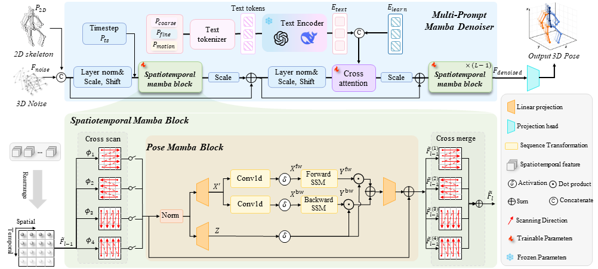
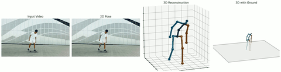
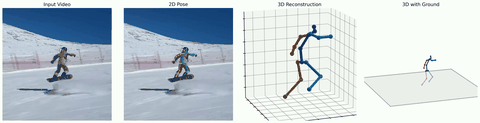
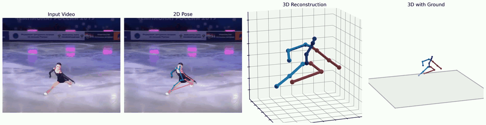
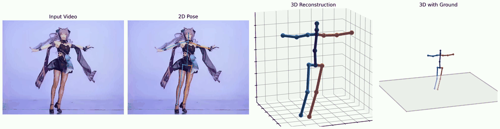

# DiMMPose

<h3 align="center">
  DiMMPose: A Diffusion-Mamba Hybrid Framework with Multi-Prompt for Efficient and Robust 3D Human Pose Estimation
</h3>

<p align="center">
  <a href="https://arxiv.org/abs/xxxx.xxxxx"></a>
  <a href="#"></a>
</p>

---

## 📢 News
- **[2024.xx]** Paper is coming soon!
- **[2024.xx]** Code will be released soon!

---

## 📊 Method

<p align="center">
  
</p>

---

## 🎬 Results

<p align="center">
  
  
</p>

<p align="center">
  
  
</p>

---

## 📖 Citation

If you find this work useful, please consider citing:

```bibtex
@article{dimmpose2024,
  title={DiMMPose: A Diffusion-Mamba Hybrid Framework with Multi-Prompt for Efficient and Robust 3D Human Pose Estimation},
  author={Your Name},
  journal={arXiv preprint arXiv:xxxx.xxxxx},
  year={2024}
}
```

---

## 📧 Contact

If you have any questions, please feel free to contact: `your-email@example.com`

---

**Code coming soon! ⭐ Star this repo to stay updated!**
